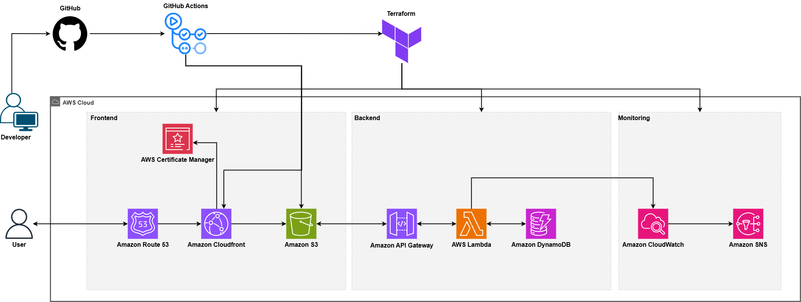

# CloudResume

Live site → [firasbennacib.com](https://firasbennacib.com)

## Overview

This project is my version of the [Cloud Resume Challenge](https://cloudresumechallenge.dev/docs/the-challenge/aws/), a hands-on initiative to build and deploy a personal resume website using AWS. It features a serverless backend, CI/CD with GitHub Actions, and infrastructure managed through Terraform.

## Table of Contents

- [Features](#features)
- [Architecture](#architecture)
- [Project Structure](#project-structure)
- [Installation](#installation)
- [Usage](#usage)
- [CI/CD Pipeline](#cicd-pipeline)
- [Monitoring](#monitoring)
- [License](#license)
- [Authors](#authors)
## Features

- Static resume hosted on S3 with custom domain.
- HTTPS via AWS Certificate Manager.
- Global delivery with CloudFront.
- Visitor counter using Lambda, API Gateway, and DynamoDB.
- Monitored using CloudWatch and SNS.
- Infrastructure managed by Terraform.
- CI/CD setup using GitHub Actions:
  - Frontend deployment with CloudFront cache invalidation.
  - Backend deployment with Lambda test execution.

## Architecture



### Frontend

- **Amazon S3** hosts the static site.
- **Amazon CloudFront** delivers content globally.
- **AWS Certificate Manager** handles HTTPS.
- **Amazon Route 53** routes DNS to CloudFront.

### Backend

- **Amazon API Gateway** receives requests from the frontend.
- **AWS Lambda** updates and fetches the view count.
- **Amazon DynamoDB** stores view counts.

### Monitoring

- **Amazon CloudWatch** monitors Lambda and cost metrics.
- **Amazon SNS** sends alerts based on CloudWatch alarms.

## Project Structure

```plaintext
cloud-resume/
├── frontend/
│   ├── index.html
│   ├── script.js
│   ├── style.css
│   ├── toggle.css
│   ├── files/
│   └── images/
├── terraform/
│   ├── main.tf
│   ├── providers.tf
│   ├── backend.tf
│   ├── outputs.tf
│   ├── terraform.tfvars
│   ├── modules/
│   │   ├── acm/
│   │   ├── apigateway/
│   │   ├── cloudfront/
│   │   ├── cloudwatch/
│   │   ├── dynamodb/
│   │   ├── frontend_upload/
│   │   ├── iam/
│   │   ├── lambda/
│   │   ├── route53/
│   │   ├── s3/
│   │   └── sns/
├── .github/
│   └── workflows/
```

## Installation

1. Clone the repository:
   ```bash
   git clone https://github.com/firassBenNacib/CloudResume.git
   cd CloudResume
   ```

2. Set up your `terraform.tfvars` using the example provided:
   ```bash
   cp terraform/terraform.tfvars.example terraform/terraform.tfvars
   ```

3. Initialize and apply Terraform:
   ```bash
   cd terraform
   terraform init
   terraform apply
   ```

## Usage

- The frontend files (`index.html`, `script.js`, etc.) are uploaded to the S3 bucket.
- A Lambda function (`views_counter.py`) updates and returns visitor counts.
- JavaScript fetches the count from the API and shows it in the UI.

## CI/CD Pipeline

- **GitHub Actions** automates deployment for both frontend and backend:
  - **Frontend Pipeline**:
    - Runs on each commit to `main` or `frontend` branch.
    - Uploads static files (HTML, CSS, JS) to S3.
    - **Invalidates CloudFront cache** to reflect changes immediately.
  - **Backend Pipeline**:
    - Runs on changes to `terraform` or `backend` code.
    - Executes **unit tests** for the Lambda function before deployment.
    - Applies infrastructure updates using Terraform.


## Monitoring

- **CloudWatch** tracks:
  - Lambda invocations and errors.
  - Billing metrics (if budget alerting is configured).
- **SNS** sends notifications:
  - To email (or SMS/webhook) if an error occurs or a threshold is crossed.

## License

This project is licensed under the [MIT License](./LICENSE).

## Authors

Created and maintained by [Firas Ben Nacib](https://github.com/firassBenNacib) - bennacibfiras@gmail.com
